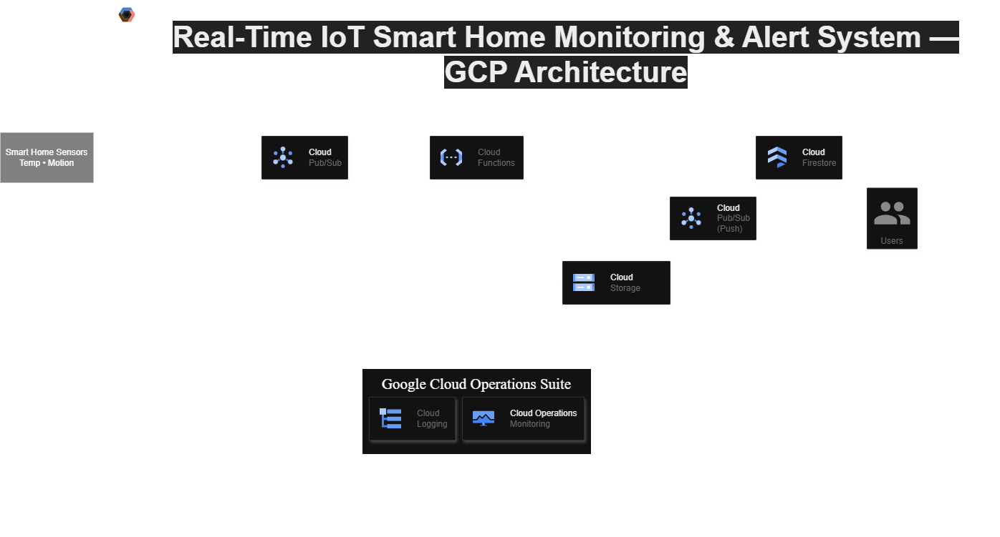

# 🏠 Smart Home IoT - Google Cloud Platform

Proyek Implementasi Arsitektur Cloud Computing untuk sistem Smart Home berbasis IoT menggunakan layanan **GCP**.

---

## 👥 Tim Proyek
| Nama | NIM | Peran |
| :--- | :--- | :--- |
| **Bramatio Manjin** | 2330205030052 | DevOps Engineer |
| **Ciko Christian** | 2330205030059 | Cloud Architect |
| **Gregio Rafael Leon Jordan** | 2330305030072 | Backend Developer |
| **Haryadi Yusuf** | 2330305030074 | Cloud Analyst |

---

## 🏗️ Arsitektur Sistem
Berikut adalah rancangan infrastruktur serverless yang kami gunakan:

## 💰 Estimasi Biaya Bulanan (GCP)
Berdasarkan perhitungan GCP Calculator:

| Layanan | Estimasi Biaya (IDR) |
| :--- | :--- |
| **Cloud Storage** | Rp 4.248,90 |
| **Cloud Functions** | Rp 3.313,19 |
| **Cloud Logging** | Rp 158,38 |
| **Cloud Pub/Sub** | Rp 45,53 |
| **Firestore** | Rp 0,00 (Free Tier) |
| **TOTAL** | **Rp 7.766,00** |

> *Detail lengkap dapat dilihat pada file: [estimasi-biaya-gcp.csv](docs/estimasi-biaya-gcp.csv)*

---

## 📁 Struktur Folder
* `docs/`: Dokumentasi perencanaan, diagram, dan rincian biaya.
* `src/`: Kode sumber aplikasi (Coming Soon - Minggu 2).
* `terraform/`: Kode infrastruktur (Coming Soon - Minggu 2).